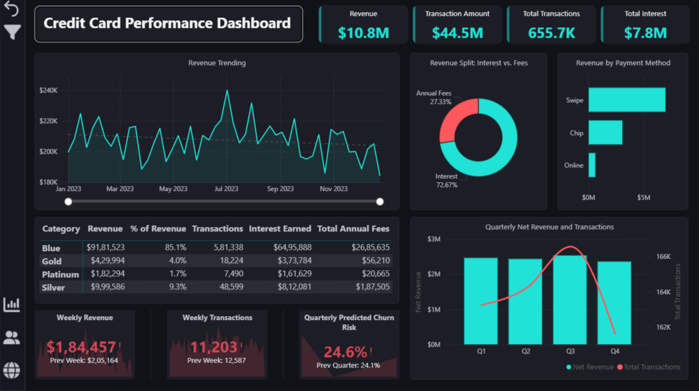
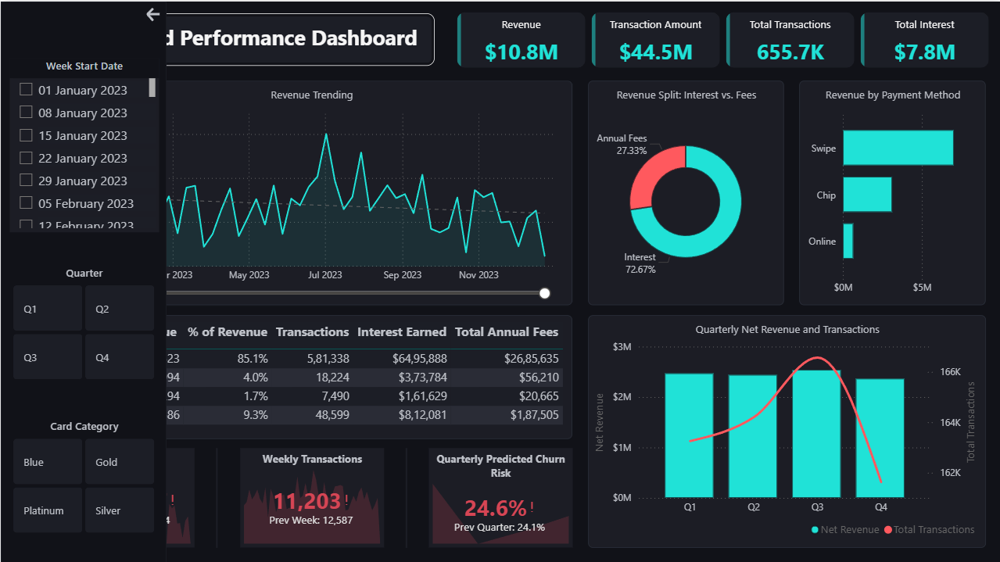
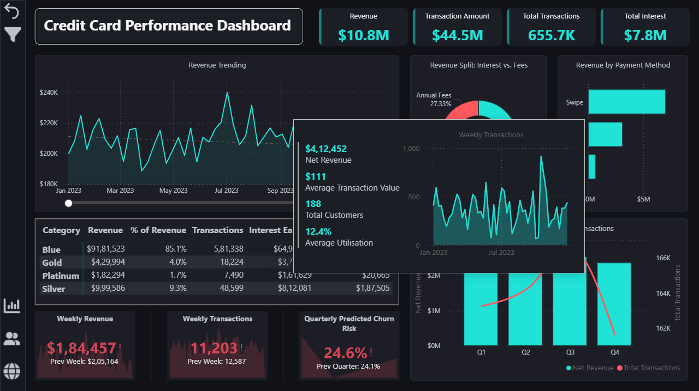
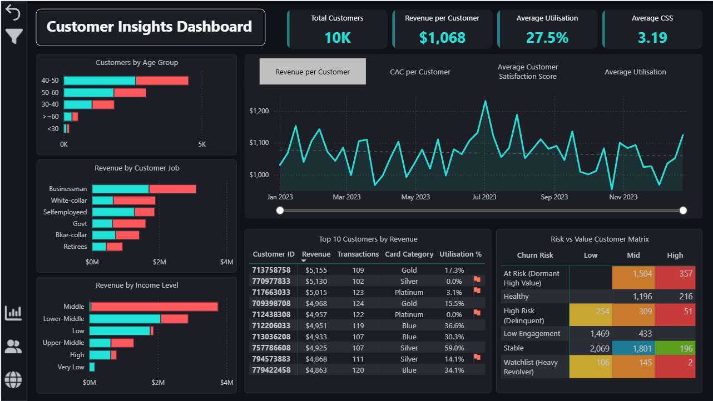
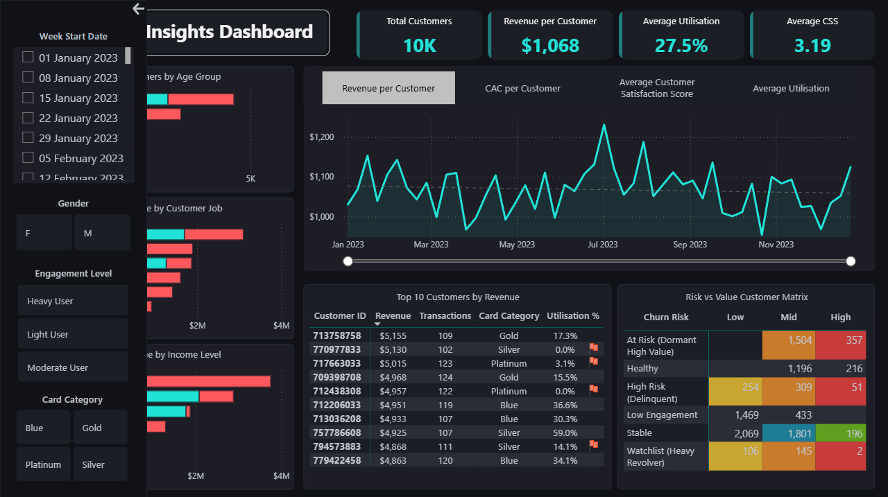
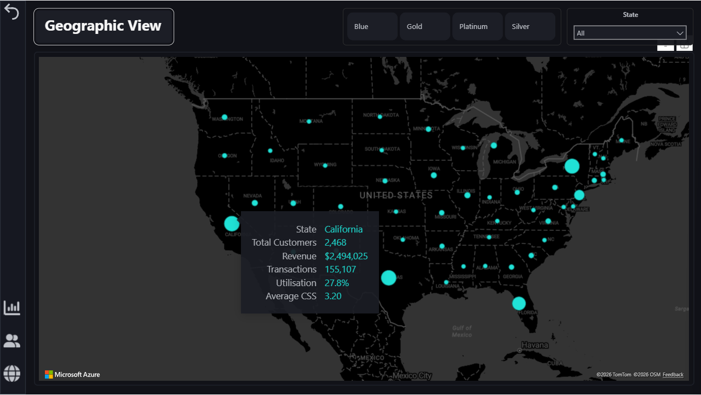

# Credit Card Financial Insights Dashboard

This project presents an analytical dashboard solution built using Power BI to evaluate credit card portfolio performance, customer behavior, and churn-risk exposure across the United States. The dashboard consolidates customer and transaction-level data sources and provides both high-level portfolio KPIs and granular insights through dynamic filtering and drill-based interactions.

---

## 🔗 Live Dashboard & Report

👉 **[View the interactive Power BI Dashboard](https://app.powerbi.com/view?r=eyJrIjoiYjBhMTBhZjktY2MyYy00Y2M1LWJiN2YtMjBjN2NiM2ZlOTllIiwidCI6ImNjN2FhMmYzLWMxNjktNGM1MS04NDZkLTdmMWY4MmRhZmMzYiJ9&pageName=ae9a1a26966c3864e966)**  
📘 **[View the detailed PDF report](Credit%20Card%20Insights%20Dashboard%20Report.pdf)**

---

## 🧩 Business Context

Credit card issuers operate in a highly competitive environment where profitability depends on effective portfolio management, customer engagement, and early identification of churn risk.  
This project simulates a real-world business scenario where stakeholders need to:

- Monitor revenue, transactions, and interest income at a portfolio level  
- Understand customer demographics, spending behavior, and engagement patterns  
- Identify high-value customers at risk of churn before revenue loss occurs  
- Evaluate geographic performance to support regional strategies  

The dashboard is designed to serve **executive leadership, risk teams, and customer strategy teams** by providing both high-level oversight and granular customer insights.

---

## 🏗 Data Architecture

- Raw datasets were first loaded into a **MySQL database** to ensure structured storage, consistent data types, and relational integrity.  
- Power BI was connected directly to the MySQL source during development.  
- For public sharing, the model was reconfigured to use **CSV-based data sources** with dynamic file paths.  
- The data model follows a **star schema**, with:
  - **Transaction table** as the fact table  
  - **Customer table** as the dimension table  

This design supports scalability and seamless refresh if new data is added.

---

## 📊 Dashboard Pages

### 1️⃣ Executive Dashboard

Provides a consolidated view of overall portfolio performance and key business KPIs.

Key focus areas:
- Total revenue, transaction amount, interest earned
- Weekly revenue and transaction trends
- Revenue split between interest and fees
- Revenue by card category and payment method
- Quarterly churn-risk KPI for retention health monitoring

---

### 2️⃣ Customer Insights Dashboard

Focuses on understanding customer composition, behavior, and risk exposure.

Key focus areas:
- Customer demographics by age group, income level, and occupation
- Revenue contribution across customer segments
- Top customers by revenue with utilization-based risk indicators
- **Risk vs. Value heatmap** highlighting high-priority retention segments
- Dynamic metric comparison to analyze trends over time

---

### 3️⃣ Geographic Analysis

Analyzes portfolio performance across U.S. states to uncover regional patterns.

Key focus areas:
- Customer concentration by state
- State-level revenue and transaction contribution
- Utilization and customer satisfaction trends by geography
- Interactive map tooltips for contextual regional insights

---

## 🧠 Key Analytical Features

- **Profitability tiers** to classify customers by revenue contribution  
- **Churn-risk scoring logic** based on utilization ratio, delinquency status, and spending behavior  
- **Customer personas** combining churn risk and profitability tiers for strategic grouping  
- Rolling averages, week-over-week trends, and quarter-over-quarter KPIs  
- Advanced DAX to support segmentation, monitoring, and insight generation  

---

## 📈 Actionable Insights (Highlights)

- **Blue card customers contribute ~85% of total revenue ($9.18M)**, indicating strong product-market fit but also high concentration risk; diversification through targeted upgrades could reduce dependency.
- **Customer satisfaction scores improved sharply mid-year**, stabilizing above 4.1, suggesting successful operational or service-level improvements.
- **357 high-value customers are classified as “At Risk (Dormant High Value)”**, representing the most critical segment for proactive retention campaigns.
- **California, Texas, and New York** each generate approximately $2.5M in revenue, forming the core portfolio footprint.
- Smaller states such as **Oregon and Nebraska** exhibit unusually high utilization despite low customer counts, indicating potential niche growth opportunities.

---

## 🛠 Tools & Skills Demonstrated

- Power BI (data modeling, advanced DAX, visual analytics)
- MySQL (database setup and integration)
- KPI design and churn-risk modeling
- End-to-end analytics workflow and reporting
- Business-oriented data storytelling

   
